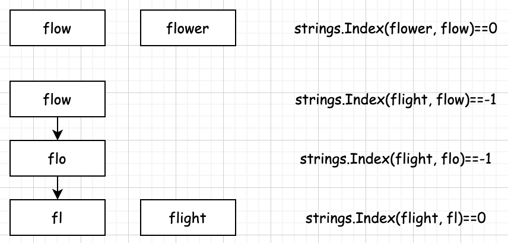

# 最长公共前缀
## 一、题目
编写一个函数来查找字符串数组中的最长公共前缀。如果不存在公共前缀，则返回""
### 1.1 示例1
```
输入: ["flower","flow","flight"]
输出: "fl"
```
### 1.2 示例2
```
输入: ["dog","racecar","car"]
输出: ""
```
## 二、解题思路
> 我们要想寻找最长公共前缀，那么首先这个前缀是公共的，我们可以从任意一个元素中找到它。假定我们现在就从一个数组中寻找最长公共前缀，那么首先，我们可以将第一个元素设置为基准元素x0。假如数组为["flow","flower","flight"]，flow就是我们的基准元素x0。

### strings.index
Index 返回子串 sep 在字符串 s 中第一次出现的位置
如果找不到，则返回 -1，如果 sep 为空，则返回 0。使用 Rabin-Karp 算法实现  
func Index(s, sep string) int
